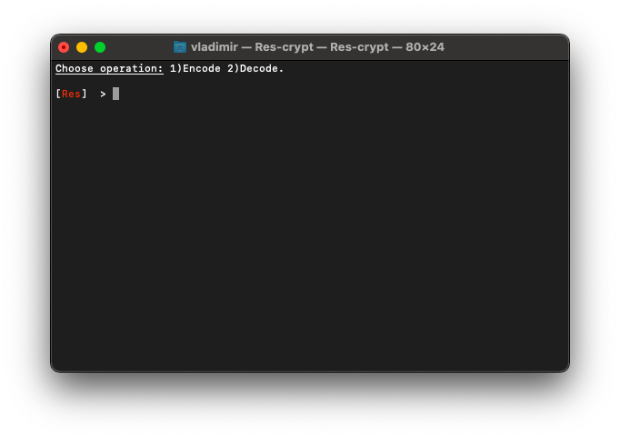
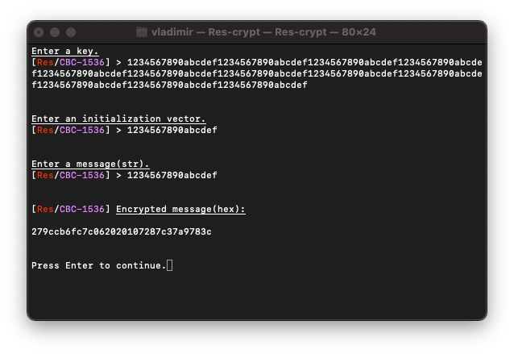
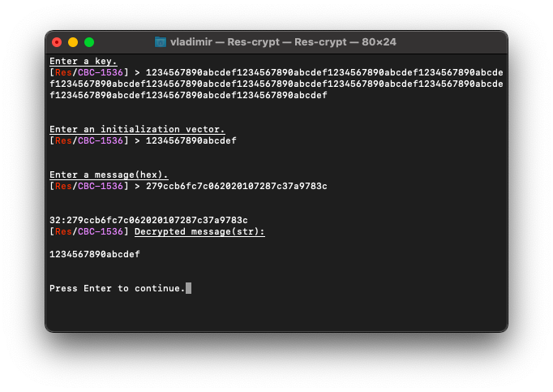

# 🔑 RES_Implementation (معيار التشفير ريد) [](https://github.com/Red-company/RES_Implementation/blob/main/LICENSE.md) 

> ‼️ *Patenting in process.* Don't try to steal or you'll lose your money.
> 


## What is it?

This is a small and portable _C++17_ implementation of the _Red Encryption Standard(RES)_. At this repository you also can find _'Res-crypt'_ terminal application which helps you to _encrypt/decrypt_ strings.
_RES_ is upgraded version of _Advanced Encryption Standard(AES)_ and is a part of [_RedLibrary_](https://github.com/Red-company/RedLibrary).

## Where to use?

_RES_ has excess level of encryption, and should be used in specific tasks, where you need absolute encryption and ready to sacrifice your perfomance. If you need perfomance, we advise you to use _AES_([_Aes implementation_](https://github.com/red-sayed/AES_Implementation)).

## What does RES consist of?
_RES_ includes 2 encryption modes: [_ECB_](https://en.wikipedia.org/wiki/Block_cipher_mode_of_operation#Electronic_Codebook_.28ECB.29) and [_CBC_](https://en.wikipedia.org/wiki/Block_cipher_mode_of_operation#Cipher_Block_Chaining_.28CBC.29) with 3 key length cases for each of them:

* _ECB_
  * _ResECB 512 bits key_
  * _ResECB 1024 bits key_
  * _ResECB 1536 bits key_
  
* _CBC_
  * _ResCBC 512 bits key_
  * _ResCBC 1024 bits key_
  * _ResCBC 1536 bits key_

## How to use it?

There are 7 header files(6 with algorithms and 1 with shared definitions) and 6 source files(for each of algorithm).

```C
// ResECB512.h
std::string * EncryptResECB512(const std::string& in, const std::string_view key);
std::string * DecryptResECB512(const std::string& in, const std::string_view key);

// ResECB1024.h
std::string * EncryptResECB1024(const std::string& in, const std::string_view key);
std::string * DecryptResECB1024(const std::string& in, const std::string_view key);

// ResECB1536.h
std::string * EncryptResECB1536(const std::string& in, const std::string_view key);
std::string * DecryptResECB1536(const std::string& in, const std::string_view key);

// ResCBC512.h
std::string * EncryptResCBC512(const std::string& in, const std::string_view key, const std::string_view iv);
std::string * DecryptResCBC512(const std::string& in, const std::string_view key, const std::string_view iv);

// ResCBC1024.h
std::string * EncryptResCBC1024(const std::string& in, const std::string_view key, const std::string_view iv);
std::string * DecryptResCBC1024(const std::string& in, const std::string_view key, const std::string_view iv);

// ResCBC1536.h
std::string * EncryptResCBC1536(const std::string& in, const std::string_view key, const std::string_view iv);
std::string * DecryptResCBC1536(const std::string& in, const std::string_view key, const std::string_view iv);
```

**Tech notes:**
 * Padding is provided only for _"in"_ params. _"Iv"_ should equals 16 bytes. Key length(in bytes) is calculated using the formula: _`KEY_LENGTH / 8`_.
 * _ECB_ mode is considered unsafe for most uses and is not implemented in streaming mode. See [_wikipedia's article on ECB_](https://en.wikipedia.org/wiki/Block_cipher_mode_of_operation#Electronic_Codebook_(ECB)) for more details.
 * This library is designed for small code size and simplicity, intended for cases where small binary size, low memory footprint and portability is more important than high performance.

**Notes:**
 * If you want to route result of encryption to _`std::cout`_, you should convert string to hexadecimal system, in other way you will get bad output!
  * **Convertion functions are included in each of examples.**
 * There is no built-in error checking or protection from out-of-bounds memory access errors as a result of malicious input.

## Screenshots? Here they are:

Here's an example of encryption in _CBC1536_ mode:



And the following one is the decryption of previous message:



##
All material in this repository is in the public domain.<br/>
With _**Copyright© ∞ [Vladimir Rogozin](https://github.com/red-sayed).**_

